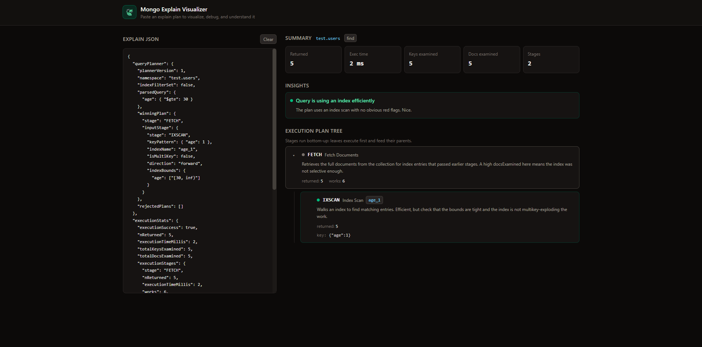

# Mongo Explain Visualizer

A small React app to **visualize, debug, and explain MongoDB explain plans**.
Paste the JSON output of `explain()` and the app renders the execution-plan
tree, a stats summary, and plain-language insights flagging common performance
problems (collection scans, blocking sorts, low index selectivity, etc.).



## Stack

- React 19 + TypeScript
- Vite
- Tailwind CSS v4 (stone dark theme throughout)

## Getting started

```bash
npm install
npm run dev      # start the dev server
npm run build    # type-check + production build
npm run preview  # preview the production build
```

## How to use

1. In `mongosh`, run an explain with execution stats:

   ```js
   db.orders.find({ status: "shipped" }).sort({ createdAt: -1 }).explain("executionStats")
   ```

2. Copy the JSON result and paste it into the left panel (or click a sample).
3. Read the **Summary**, **Insights**, and **Execution Plan Tree** on the right.

`queryPlanner`-only output (without `executionStats`) is supported too — you
just won't get timing/examined metrics. Aggregation explains are read via their
`$cursor` stage.

## Project layout

```
src/
  lib/
    parseExplain.ts   normalize raw explain JSON -> plan tree + insights
    stageInfo.ts      plain-language descriptions per stage type
    severity.ts       Tailwind class sets per severity
  components/
    Summary.tsx       top-line stats
    Insights.tsx      flagged performance findings
    StageNode.tsx     recursive plan-tree node
  sampleData.ts       example explain plans
  types.ts            shared types
  App.tsx             layout + input handling
```
